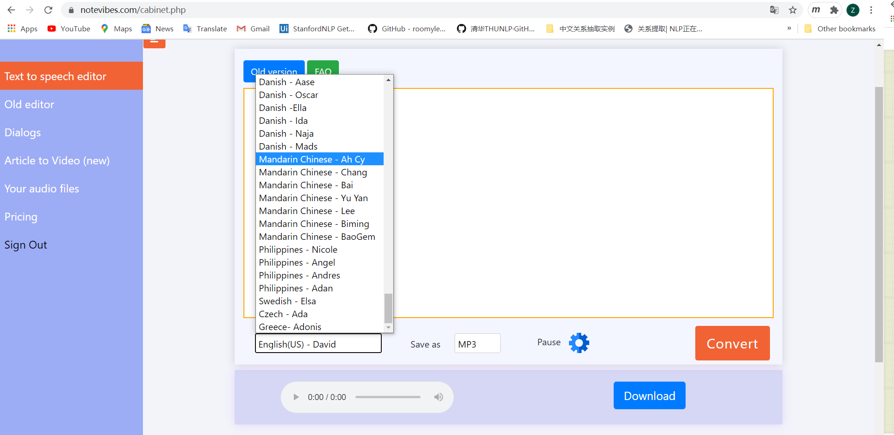
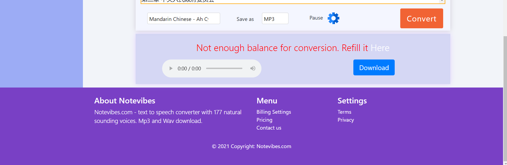

# 批量语音转换（notevibes_spider）

此代码完成一个针对 notevibes 文本转语音网站进行批量语音转换的简单爬虫

## selenium

selenium 是一个用于 Web 应用程序测试的工具，可以模拟用户操作来运行浏览器。对于通过 js 获取数据并进行渲染的内容，可使用 selenium 驱动浏览器加载网页来获取动态渲染的结果。

所以，当涉及到网页点击或交互时，可以用 selenium 方便地实现爬虫性能。

安装 selenium

```
pip install selenium
```

安装 webdriver，即相应浏览器驱动。这里用的是 Chrome 浏览器，需要下载 `chromedriver.exe`，对应网址

```
https://sites.google.com/a/chromium.org/chromedriver/home
```

下载解压后将 `chromedriver.exe` 复制到谷歌浏览器目录（My：C:\Program Files (x86)\Google\Chrome\Application）和 python 根目录下，将这两个添加到环境变量 Path 中，否则会出现 `'chromedriver' executable needs to be in PATH` 错误。用 Anaconda3 的可以直接放到相关目录下（My：D:\Anaconda\Anaconda3 和 D:\Anaconda\Anaconda3\Scripts）。

### 下拉框处理

登入网站后首先要选择文字转语音的音源选项，这里通过一个下拉框选择。



对应网页的 `<select></select>` 标签，selenium 提供了专门的 Select 类来处理这种下拉框，记得导入新的模块 `from selenium.webdriver.support.ui import Select`。先看看 HTML 中 select 长什么样子

```html
<div class="col-sm">
      <select name="voice" id="voice" style="width:220px">
       <option id="google" selected="SELECTED" value="en-US-Wavenet-D">English(US) - David</option>
      <option id="google" value="en-US-Wavenet-A">English(US) -  Rick</option>
      <option id="google" value="en-US-Wavenet-B">English(US) - John</option>
      <option id="google" value="en-US-Wavenet-C">English(US) - Lucy</option>
      <option id="google" value="en-US-Wavenet-E">English(US) - Kate</option>
      <option id="google" value="en-US-Wavenet-F">English(US) - Rina</option>
        .
        .
        .
      <option id="amazon" engine="standard" value="Naja">Danish - Naja</option>
      <option id="amazon" engine="standard" value="Mads">Danish  - Mads</option>

      <option id="google" value="cmn-CN-Wavenet-A">Mandarin Chinese - Ah Cy  </option>
      <option id="google" value="cmn-CN-Wavenet-B">Mandarin Chinese - Chang  </option>
      <option id="google" value="cmn-CN-Wavenet-C">Mandarin Chinese - Bai  </option>
      <option id="google" value="cmn-CN-Wavenet-D">Mandarin Chinese - Yu Yan  </option>

      <option id="google" value="cmn-TW-Wavenet-A">Mandarin Chinese - Lee  </option>
      <option id="google" value="cmn-TW-Wavenet-B">Mandarin Chinese - Biming  </option>
      <option id="google" value="cmn-TW-Wavenet-C">Mandarin Chinese - BaoGem  </option>

      <option id="google" value="fil-PH-Wavenet-A">Philippines - Nicole </option>
      <option id="google" value="fil-PH-Wavenet-B">Philippines - Angel </option>
      <option id="google" value="fil-PH-Wavenet-C">Philippines - Andres </option>
      <option id="google" value="fil-PH-Wavenet-D">Philippines - Adan	 </option>

      <option id="google" value="sv-SE-Wavenet-A">Swedish - Elsa </option>
      <option id="google" value="cs-CZ-Wavenet-A">Czech - Ada </option>
      <option id="google" value="el-GR-Wavenet-A">Greece- Adonis </option>

        </select>
        </div>
        <div class="col-sm">
        <!-- Pitch Select end -->
    Save as
         <!-- SAVEAS Select start -->
      <select name="saveas" id="saveas" style="width:80px;">
      <option value="mp3" selected="SELECTED">MP3</option>
      <option value="wav">WAV</option>
          </select>

</div>
```

注意到 select name="voice"。

我们需要等网站登录缓冲结束后再操作下拉框，WebDriverWait 设定在满足特定条件后立即执行相关操作（记得导入 from selenium.webdriver.support.ui import WebDriverWait）。这里可以设定下拉框出现后选择切换。

```python
# 等待，判断元素是否出现
WebDriverWait(browser, 20).until(EC.visibility_of_element_located((By.NAME,'voice')))
```

想要操作 select，先要定位到 select 上，并实例化

```python
select = browser.find_element_by_name('voice')
```

元素定位方法如下，这里使用的是 find\_element\_by\_name

```
find_element_by_id
find_element_by_name
find_element_by_xpath
find_element_by_link_text
find_element_by_partial_link_text
find_element_by_tag_name
find_element_by_class_name
find_element_by_css_selector
```

Select 的定位和操作方法见 [网址](https://selenium-python.readthedocs.io/navigating.html#filling-in-forms)，这里用 select\_by\_value 定位下拉框，选中普通话下的第一个选项

```python
# 选中普通话下的第一个选项
# <option id="google" value="cmn-CN-Wavenet-A">Mandarin Chinese - Ah Cy  </option>
classSelectValue="cmn-CN-Wavenet-A"
Select(select).select_by_value(classSelectValue)
```

至此完成下拉框处理

### 输入框处理

这一部分批量读入文件夹 `D:\\dream\\ToSpeech\\text\\` 下的文件，将每个文件中的文本输入到网页输入框中，完成文本到语音的转换，并下载转换后的语音 mp3 文件。

文件的遍历和读取已经写过很多次了，可以看 `readText.py`，这里就不再赘述。

前边介绍元素定位方法时，提到 find\_element\_by\_xpath，这里通过 xpath 在网页中定位表单、输入数据。xpath 的获取可以查看网页源码，或者鼠标右键点击目标位置选择检查/F12，在检查器中点箭头选中相应的位置，右键 copy xpath 即可，具体可参看 [知乎文章](https://zhuanlan.zhihu.com/p/88295644)。

```python
# 注意：输入文字有长度限制
# <div contenteditable="true" id="editor" maxlength="20000" placeholder="Enter text here...">
# 拿到搜索框
input = browser.find_element_by_xpath("//*[@id='editor']")
# 清空之前的内容
input.clear()
# 输入文本 s
input.send_keys(s)
input.send_keys(Keys.RETURN)
# 点击 convert 按钮
browser.find_element_by_id("btnSubmit").click()
```

完成文本的填入和转换。此处注意目标网站的输入文字（textarea\_message）有长度限制，需要预先截断。

```html
<script>

$('#editor').on('keyup',function()
{
  var maxlen = $(this).attr('maxlength');
  var length = $(this).text().length;
  if(length > (maxlen-1000) ){
    $('#textarea_message').text('Max text length '+maxlen+' characters! Please split your text into smaller parts.')
  }
  else
    {
      $('#textarea_message').text('');
    }
});

 </script>
```

最后点击 download 按钮完成下载

```python
wait = WebDriverWait(browser, 10)
button = wait.until(EC.element_to_be_clickable((By.XPATH, '//*[@id="downloadpanel"]/div/div[2]/div/a')))
button.click()
```

不过注意，网站有限制免费转换字数，超出会提醒，无法继续转语音



### 网站登录

我尝试过 cookies 登录的各种方式，可以获得网站的 cookies 信息，但是完成不了登录。网站的登录方式与普通的用户名密码验证码方式有所不同，它是 login 页面跳转后要求填入邮箱，它会朝你填的邮箱地址发送一封确认邮件，你需要登录邮箱，点击邮件中的链接，直接/再次输入邮箱地址完成登录。此时刷新最初的 login 页面并不会转换到已登陆状态，再打开一个新的 Chrome 也需要再次验证登录，但 new tab 不会。网站对浏览器的登录有限制，解决方法是：先打开一个页面用来登录，留一个等待时间用以登录邮箱完成验证，时间一到 new tab 一个新页面即可，此时为已登录状态，可以进入下边的操作。

```python
browser = webdriver.Chrome('D:/Anaconda/Anaconda3/chromedriver.exe')
browser=webdriver.Chrome()
browser.get(url)    #response=
#print(response.status_code)

time.sleep(100)         # 等待网页输入邮箱的时间
print("start new page")
browser.get(url)
```

## 项目中生成 requests.txt 文件

不同电脑上环境不同，一般通过 `pip install -r requirements.txt` 命令安装来统一项目环境。

`pipreqs` 模块可直接生成当前项目使用到的第三方类库的 requirements 文件。

```
pip install pipreqs
```

安装后在项目根路径下使用

```
pipreqs ./ --encoding='utf-8'
```

即可生成对应的 requirements.txt 文件。


## Reference：
- [x] [爬虫内容学习](https://silenwang.github.io/2019/12/18/%E7%88%AC%E8%99%AB%E5%86%85%E5%AE%B9%E5%AD%A6%E4%B9%A0/)
- [ ] [Waits 官方文档](https://selenium-python.readthedocs.io/waits.html)
- [x] [selenium 下拉框处理](https://www.cnblogs.com/qican/p/13521606.html)
- [x] [selenium 填写网站表单](https://zhuanlan.zhihu.com/p/88295644)